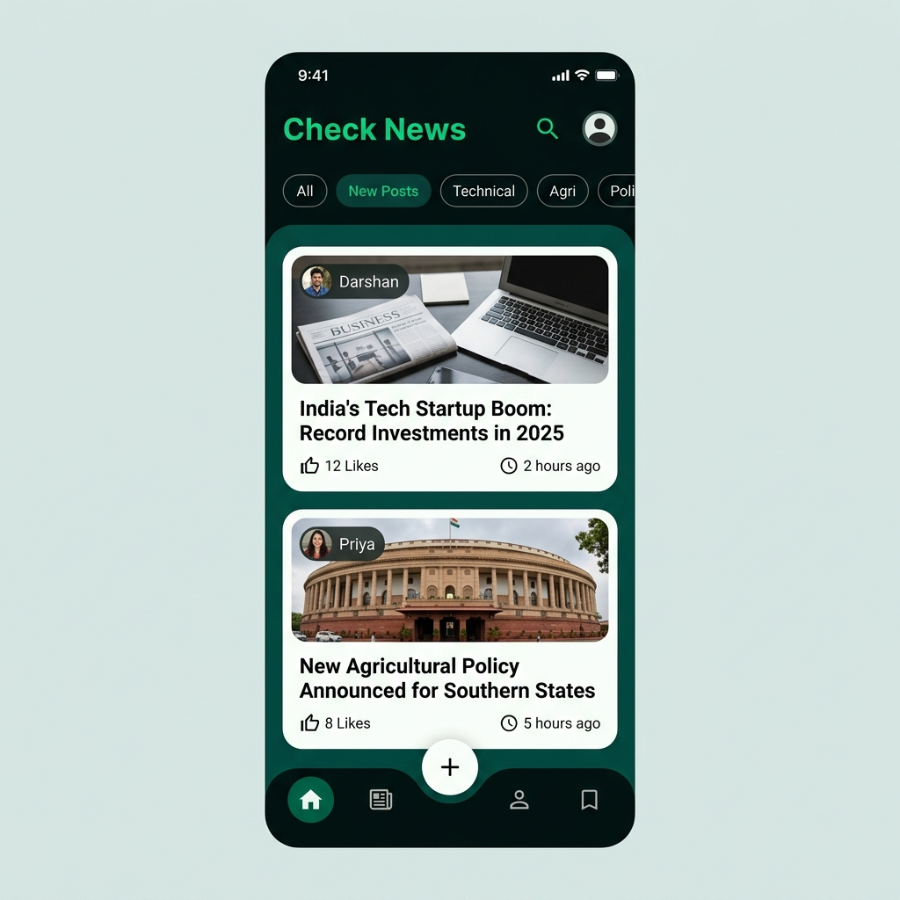
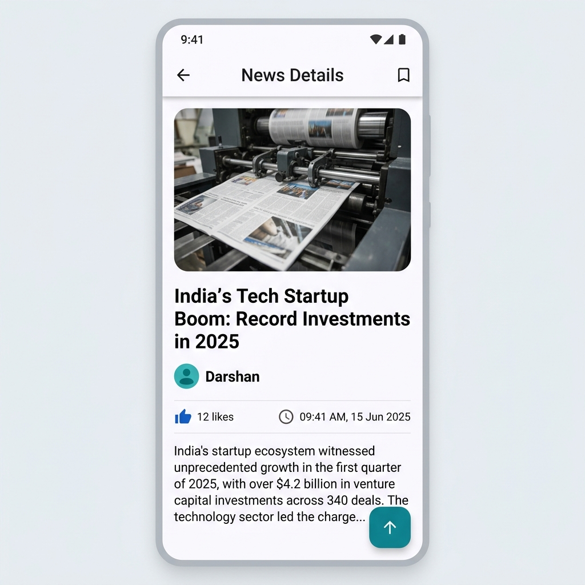
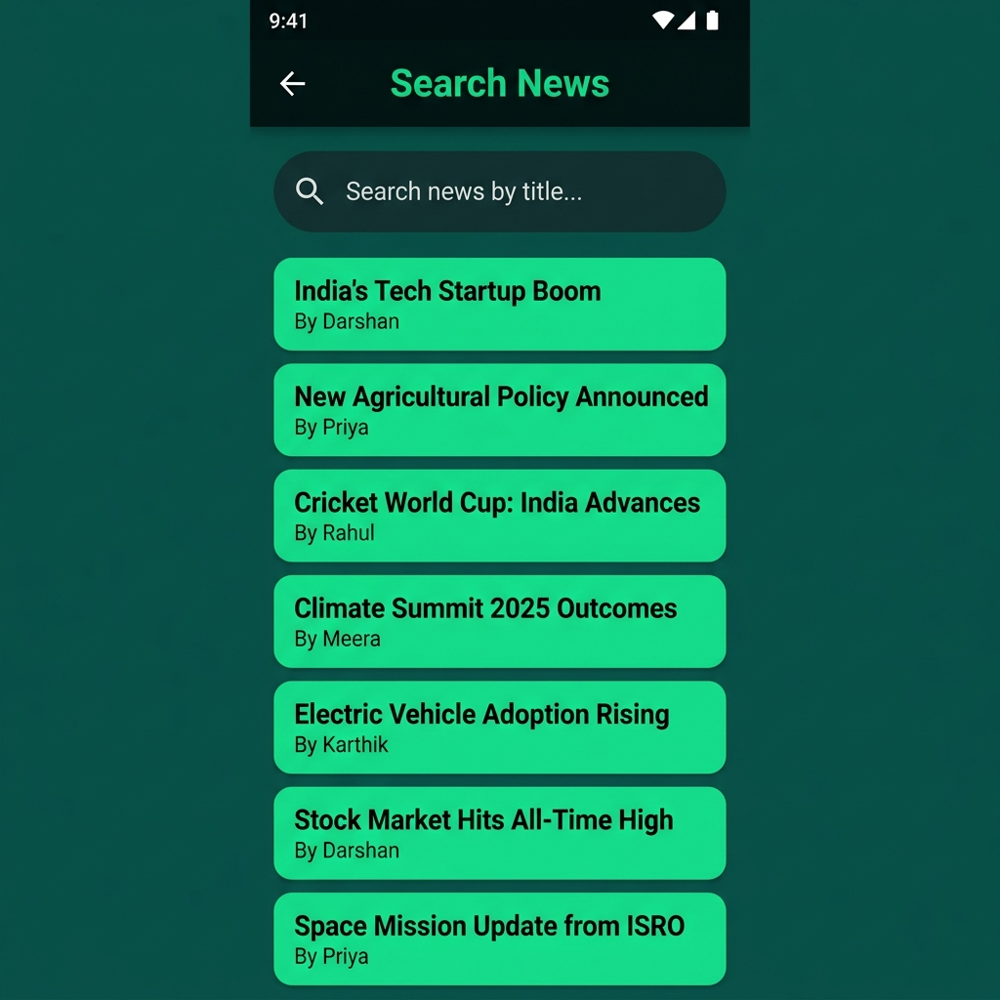
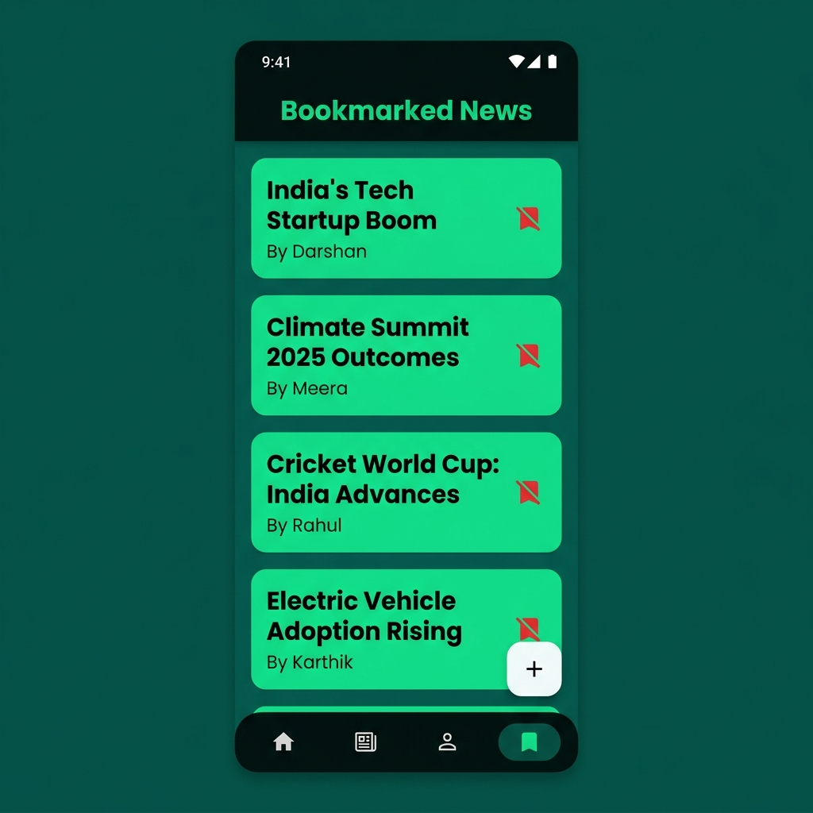
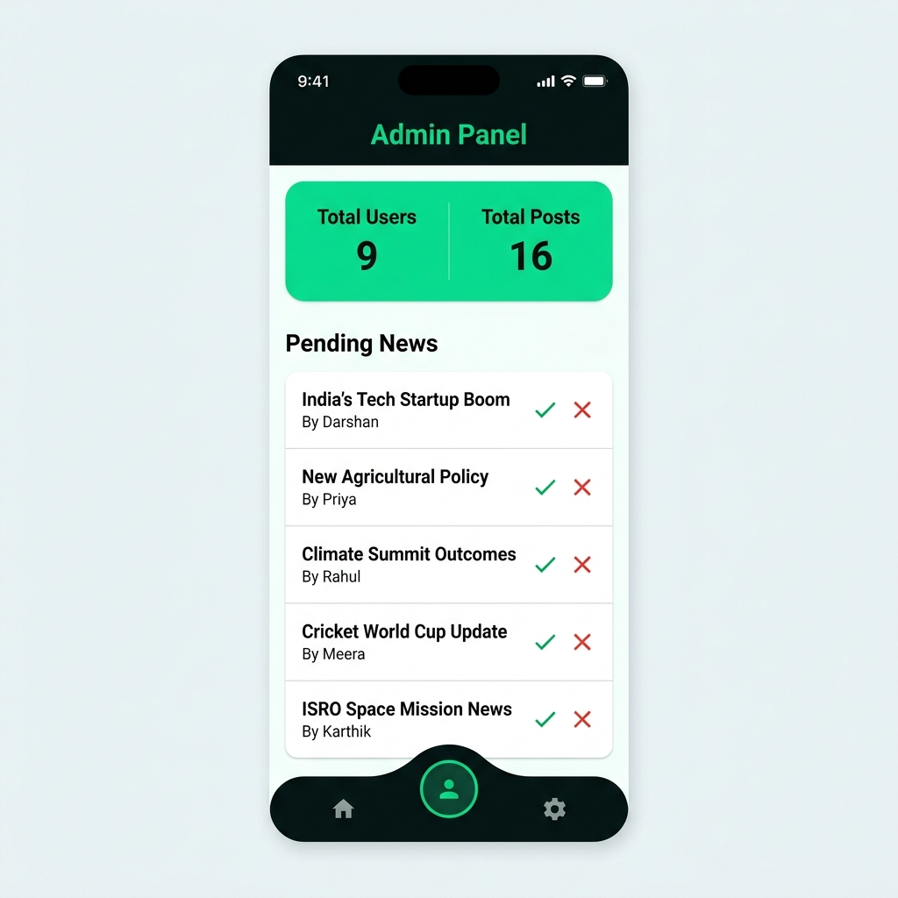

# 📰 Check News

<p align="center">
  
  
  
  
</p>

<p align="center">
  A community-driven news platform built with Flutter and Firebase — where anyone can <strong>write</strong>, <strong>share</strong>, and <strong>discover</strong> news stories across multiple categories.
</p>

---

## ✨ Features

### 🔐 Authentication
- **Email & Password** login and registration with **email verification** flow
- **Phone Number (OTP)** authentication using Firebase Phone Auth
- **Role-based access control** — regular users and admins are routed to different home screens
- Persistent auth state — users stay logged in across sessions

### 📰 News Feed
- Real-time news feed powered by **Cloud Firestore** live streams
- News is displayed only after **admin approval** (`approved` status)
- **Category filters** — filter news by: `New Posts`, `All`, `Trending`, `Technical`, `Agri`, `Politics`
- **Liquid pull-to-refresh** animation for refreshing the feed
- News sorted by date (newest first)

### 📝 Publish News
- Any logged-in user can **submit a news article** (title + content)
- **Multi-image upload** support via **Cloudinary** CDN
- Image selection from the device gallery using a file picker
- News goes into a **pending queue** awaiting admin approval before being visible to others

### 🔍 Search
- Real-time **search by title** across all approved news articles
- Instant filtering as the user types, powered by Firestore queries

### 📄 News Details
- Full article view with title, author, content, and publish timestamp
- **Horizontal image gallery** — tap any image to open a full-screen image viewer
- **Like / Dislike** a post (stored per-user in Firestore)
- **Bookmark** articles to save them for later
- Floating "scroll to top" action button

### 🔖 Bookmarks
- Dedicated bookmarks page listing all saved articles
- Remove bookmarks directly from the list with a single tap
- Real-time Firestore sync keeps bookmarks up to date

### 👤 User Profile
- View your **name** and **phone number**
- **Edit display name** inline via a dialog
- Profile avatar with photo update placeholder
- **Secure logout** with confirmation dialog

### 🛡️ Admin Panel
- Separate **Admin Home** accessible only to users with the `Admin` role
- **Dashboard** with animated counters showing total users and approved posts
- **Pending News Queue** — view all articles waiting for review
- **Approve** a news article with a swipe-right gesture or the ✓ button
- **Reject / Delete** an article with a swipe-left gesture or the ✗ button
- Smooth **slide transition** animation when navigating to the admin panel

### 🎨 UI / UX
- Custom dark theme with a **green-on-dark** (`#00DF82` on `#030F0F`) color palette
- **EB Garamond** custom font for headlines
- **Curved bottom navigation bar** with smooth animation
- Material 3 design system throughout the app
- **Floating Action Button** for quick access to the "Add News" flow

---

## 🏗️ Tech Stack

| Layer | Technology |
|---|---|
| **Framework** | Flutter 3.x (Dart 3.6) |
| **Backend / Database** | Firebase Cloud Firestore |
| **Authentication** | Firebase Auth (Email + Phone OTP) |
| **Image Hosting** | Cloudinary |
| **State Management** | Provider |
| **Push Notifications** | Firebase Cloud Messaging (FCM) |
| **Environment Config** | `flutter_dotenv` |

---

## 📦 Key Dependencies

| Package | Purpose |
|---|---|
| `firebase_core` | Firebase initialization |
| `firebase_auth` | User authentication |
| `cloud_firestore` | Real-time database |
| `firebase_storage` | Firebase file storage |
| `firebase_messaging` | Push notifications |
| `provider` | State management |
| `image_picker` | Device gallery access |
| `file_picker` | File selection for uploads |
| `http` | Cloudinary API calls |
| `cloudinary_services` | Custom Cloudinary upload/delete |
| `shared_preferences` | Local key-value storage |
| `lottie` | Lottie animations |
| `liquid_pull_to_refresh` | Animated pull-to-refresh |
| `curved_navigation_bar` | Stylish bottom navigation |
| `timeago` | Human-readable timestamps |
| `intl` | Date & time formatting |
| `flutter_dotenv` | `.env` file loading |

---

## 🚀 Getting Started

### Prerequisites

- Flutter SDK `^3.6.0`
- A Firebase project with **Authentication**, **Firestore**, and **Storage** enabled
- A **Cloudinary** account with an upload preset configured

### 1. Clone the repository

```bash
git clone https://github.com/your-username/check-news.git
cd check-news
```

### 2. Configure Firebase

1. Create a Firebase project at [console.firebase.google.com](https://console.firebase.google.com)
2. Enable **Email/Password** and **Phone** sign-in methods under Authentication
3. Run `flutterfire configure` to generate `lib/firebase_options.dart`

### 3. Configure Environment Variables

Create a `.env` file in the project root:

```env
CLOUDINARY_CLOUD_NAME=your_cloud_name
CLOUDINARY_UPLOAD_PRESET=your_upload_preset
CLOUDINARY_API_KEY=your_api_key
CLOUDINARY_API_SECRET=your_api_secret
```

### 4. Install dependencies

```bash
flutter pub get
```

### 5. Run the app

```bash
flutter run
```

---

## 🗂️ Project Structure

```
lib/
├── main.dart                  # App entry point, theme & routing
├── home_page.dart             # Main user shell with bottom nav bar
├── admin_home.dart            # Admin shell page
├── news_list.dart             # News feed with filters & real-time stream
├── news_details_page.dart     # Full article view (likes, bookmarks, images)
├── news_cart.dart             # News card widget
├── add_news.dart              # Create news article (title + content)
├── select_image.dart          # Image selection & Cloudinary upload step
├── search_page.dart           # Search news by title
├── bookmars.dart              # Bookmarked articles list
├── profile_pages.dart         # User profile & logout
├── admin_page.dart            # Admin panel (approve/reject news)
├── global_news.dart           # Global news data holder
├── imagepage_view.dart        # Full-screen image viewer
├── route/
│   └── login.dart             # Login page routing
├── screens/
│   ├── loginScreen.dart       # Login screen UI
│   ├── login_emaipassword.dart# Email/password login
│   ├── signinwithemai.dart    # Email sign-in flow
│   ├── sign.dart              # Phone OTP sign-in
│   └── image_post.dart        # Image posting screen
├── services/
│   ├── authprovider.dart      # Auth state management (Provider)
│   ├── firebase_auth_method.dart # Firebase Auth helper methods
│   ├── cloudinary_services.dart  # Cloudinary upload/delete
│   └── storage/
│       └── storage_services.dart # Storage service provider
└── utils/
    ├── showSnackbar.dart       # Snackbar utility
    └── showOTPDialog.dart      # OTP dialog utility
```

---

## 🔒 Firestore Data Model

### `users` collection
```
users/{uid}
  ├── name: string
  ├── phone: string
  ├── role: "Admin" | "User"
  └── bookmarks: [newsId, ...]
```

### `news` collection
```
news/{newsId}
  ├── title: string
  ├── content: string
  ├── author: string
  ├── date: timestamp
  ├── images: [url, ...]
  ├── approve: "pending" | "waiting" | "approved"
  └── likes: [userId, ...]
```

---

## 📸 Screenshots

<p align="center">
  
  &nbsp;&nbsp;
  
  &nbsp;&nbsp;
  
</p>

<p align="center">
  
  &nbsp;&nbsp;
  
</p>

<p align="center">
  <em>News Feed &nbsp;|&nbsp; Article Detail &nbsp;|&nbsp; Search &nbsp;|&nbsp; Bookmarks &nbsp;|&nbsp; Admin Panel</em>
</p>

---

## 🤝 Contributing

Contributions, issues, and feature requests are welcome!  
Feel free to open an issue or submit a pull request.

---

## 📄 License

This project is for educational and personal use. See [LICENSE](LICENSE) for details.

---

<p align="center">Built with ❤️ using Flutter & Firebase</p>
